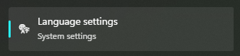
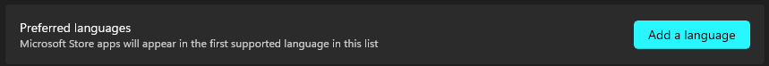
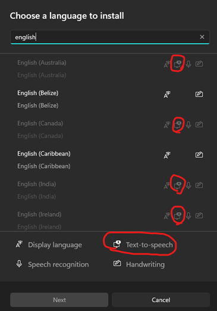
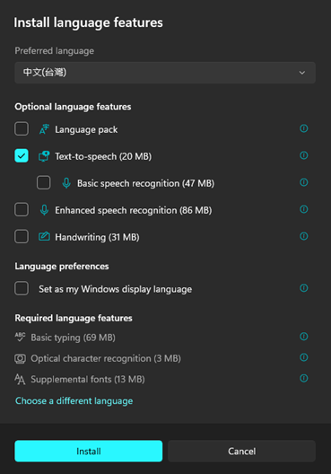
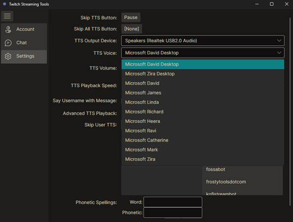
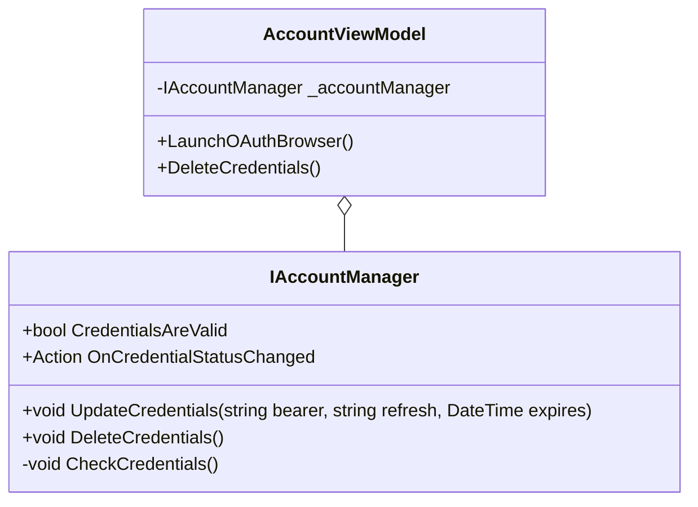

# twitch-streaming-tools

Tools to aid twitch streamers.

## To Install Additional Voices

To install additional voices you need to install the language in Windows 11:
1. Open the start menu and search for `Language Settings`

2. In the "Preferred languages" row, click "Add a language"

3. In the "Choose a language to install" dialog, select the language with "Text-to-speech" icon.
   * **Note:** Only items with the text-to-speech icon will show up in the application once installed.

4. In the "Install language features" dialog, you only need to install the "Text-to-speech" for the language and click install. 
   * **Note:** All other boxes may be **unchecked**.

Once installed (it may take some time), restart the application and they should be displayed in the settings menu under
TTS Voices.

## Design

### Account Management

Relationship between the view model and the account manager used to keep Twitch OAuth credentails up-to-date

